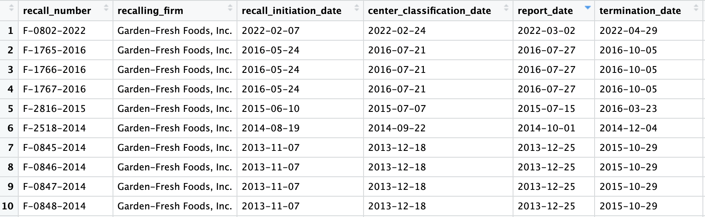

<style>
body {
text-align: justify}
</style>

```{r, include = FALSE}
knitr::opts_chunk$set(
  collapse = TRUE,
  comment = "#>"
)
```


*foodRecall* accesses and visualizes data from the openFDA Food Recall Enforcement Reports API. This document provides descriptions and examples of the functions included in the package and some information explaining the process to complete this project for STAT 585 - Data Technologies for Statistical Analysis at Iowa State University.

**Disclaimer**: This product uses the openFDA API, but is not endorsed or certified by the Food and Drug Administration (FDA).

## Background and Motivation

This project is motivated by the need for more visualization in healthcare, especially for food-related problems. In many instances, people are informed about food recalls and foodborne illnesses in
the news, but are unclear of the extent or severity of such occurrences. Likewise, many healthcare and government organizations maintain extensive records of food recalls and related illness, but there are few software packages avaialable for visualizing these types of data. The foodRecall package strives to make analysis of food recall data more accessible and easier to read and use so that scientists and civilians alike are able to make informed choices regarding food safety and security.

Our R package contains code, data, and documentation about the foodborne outbreaks that happened in the United States in the recent decade. The package helps highlight the city, state, country, and time the outbreak occurred.

## Functions and Applications

Before running any of the package functions, the user will need an API key.
To get the API key, go to the openFDA API [website](https://open.fda.gov/apis/authentication/) to register for an API key. It is free, only requires an email address. Do not share your API key with anyone!


```{r setup, eval = FALSE}

library(foodRecall)

api_key <- "YOUR API KEY"

```

```{r, eval = FALSE}
## Get food recall locations

location <- foodRecall::recall_location(api_key = api_key,
                                        city = "Milwaukee", 
                                        state = "Wisconsin", 
                                        recalling_firm = "Garden-Fresh Foods")
```


```{r knit, echo=FALSE, fig.cap="An example of the tabular output of recalls from Garden Fresh Foods in Milwaukee using the recall_location function", out.width = '100%'}



```


The recall_location function provides a list of all food recalls for a designated city. Additional functionality includes the ability to specify inputs such as the firm responsible for each recall, the current status of the recall, and the distribution pattern (which states/regions the recall has affected). One must specify their API key as the first input. For example, the above code will display all recalls over time for the city of Milwaukee from the company Garden-Fresh Foods, which has experienced many recalls, including those that are class 1 over time due to contamination of produce. The tabular output, as shown in the figure above, includes information such as the reason for recall, description of the product, quantities of recalled products, and dates of recall. One can specify any of these columns as an input to the function if they desire to look more specifically at a particular group of recalls. This tabular format places all FDA recall variables into a tidy, easy-to-read format.

```{r,eval = FALSE}
# Map food recall locations

map <- foodRecall::map_recall(data = location)

```


```{r pressure, echo=FALSE, fig.cap="Map of Food Recalls in Milwaukee using map_recall function", out.width = '100%'}

knitr::include_graphics("Rplot01.png")

```


This package provides an interactive map food recalls based on the saved location from the recall_location. All of the inputs from the recall_location function are displayed, including the firm of interest, product type, and dates of recalls. The locations of firms involved with recalled products are marked on the map with red circles. Locations on the map can be interactively sorted either by the number of recall events at a given firm, or by the total number of products recalled. Darker red circles are associated with a greater number of recall incidents.

This package provides an interactive map food recalls based on the saved location from the recall_location function. All of the inputs from the recall_location function are displayed, including the firm of interest, product type, and dates of recalls. The locations of firms involved with recalled products are marked on the map with red circles. Locations on the map can be interactively sorted either by the number of recall events at a given firm, or by the total number of products recalled. Darker red circles are associated with a greater number of recall incidents.


```{r, eval = FALSE}
# Working with food recall dates

date <- foodRecall::recall_date(api_key = api_key,
                                recall_initiation_date = "2022-02-01", 
                                termination_date = "2023-05-07", 
                                recalling_firm = "Garden-Fresh Foods")
```

```{r cars, echo=FALSE, fig.cap="Example of output from recall_date function", out.width = '100%'}

knitr::include_graphics("Rplot03.png")

```

This package allows a user to input a date or range of dates in order to see 
what types of food recalls occurred within  a certain interval of time.
For instance, the above example displays all food recalls starting on February 1st, 2022 and ending on May 7th of 2-23. Input options include the date of recall initiation, the current status of the recall, and the distribution pattern of the recall. This makes it easy and efficient to see the status of any current or past recalls that might have had an impact within a certain range of time. One current limitation, however, is that it does not provide a visually appealing tabular or graphical format that is similar to aforementioned packages. However, it is beneficial for looking up a single recall or time period of interest.


## Limitations 

Currently, our package only provides information relating to food recalls. In the future, it would be beneficial to expand this package to include foodborne illness statistics from across the globe, due to the fact that many food recalls are initiated by outbreaks of foodborne diseases. In this manner, it would be
easy and efficient to compare illness rates from foodborne diseases in different
countries. Furthermore, it would be possible to track, model, and predict the spread of 
foodborne illnesses as they move from nation to nation, which could lead to early
government intervention in containing the spread of various illnesses. One complication with this, however, is that a global database would require the combination and analysis of
a large number of datasets. Due to this, and the fact that many nations do not consistently track disease statistics, this would be quite ambitious.

## Future Work

In the future, it would be optimal to try and combine this package with other information,
such as agricultural data from the United States Department of Agriculture (USDA)
. One of the original ideas for our project dealt with analyzing crop progress data from the USDA's National Agricultural Statistics Service (NASS). This service provides information on
statistics such as crop planting, germination, harvest, etc. Many foodborne illness outbreaks 
initiate from bacteria, fungi, or insects that emerge at certain crop development stages.
If food-borne illness and crop progress statistics could be combined and analyzed together with the same package, it would be much easier for organizations such as the FDA to predict the 
severity of food-borne illnesses and to develop measures for their prevention. It
could also be a useful tool for farmers and others whose work entails a key role
in the prevention of such diseases, such as with the application of herbicides
and other agricultural chemicals. Additional agricultural statistics from
livestock facilities could be combined with these data sets in order to 
provide a more complete picture of how livestock yields over time have impacted
rates of foodborne illnesses such as salmonella.

Another possibility for a future improvement to this package would be the addition
of a feature that enables users to track areas that have featured the origin of
the most food-borne illnesses. If high-risk areas can be identified by simply keeping
a count of the number of cases of a certain disease over time, it will be easy to
pinpoint where many diseases are originating and how to prevent the spread of such
diseases. Essentially, expansions to this package could enable governmental and other
organizations to work together on joint projects relating to food safety.

Finally, additional functionality could be created that allows for the combination
of food-borne illness data with other disease related data. In this sense, it could
be useful to healthcare professionals who are treating such illnesses and may be more
interested in treatment options rather than origin of disease. Hence, it could be useful
to develop functionality with regards to symptoms and symptom severity as it relates to
diseases of interest.


